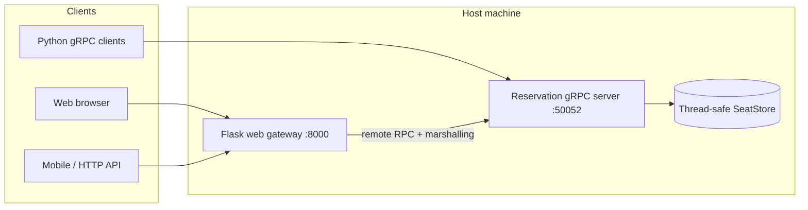

# Airline Distributed Reservation System (gRPC)

A distributed airline reservation **backend** using **gRPC (RPC)** with a **web client gateway**. Demonstrates remote procedure calls, Protobuf data marshalling, concurrent clients, and consistent seat inventory.

## Architecture



| Layer | Role |
|--------|------|
| **Protobuf (`proto/booking.proto`)** | Contract + **marshalling** (serialize requests/responses to binary) |
| **`booking_service/server.py`** | Remote **ReservationService**: check availability, book, cancel |
| **`booking_service/seat_store.py`** | **Consistency**: one in-memory store, `threading.Lock`, atomic book/cancel |
| **`frontend/app.py`** | Web/mobile **HTTP** → calls gRPC on the backend (remote invocation) |
| **`client/concurrency_test.py`** | Many threads → one seat → exactly one booking succeeds |

## Requirements demonstrated

1. **Remote invocation** — Clients call `CheckAvailability`, `BookSeat`, `CancelReservation` on the gRPC server.
2. **Data marshalling** — Protobuf encodes messages (see `proto/booking.proto`); gRPC transports them over TCP.
3. **Concurrent client access** — Run `client/concurrency_test.py` (10 threads, 1 seat).
4. **Seat consistency** — `SeatStore` uses a lock; double-booking returns `SEAT_NOT_AVAILABLE`.

## Quick start

```powershell
cd Airline_booking
pip install -r requirements.txt
.\scripts\generate_proto.ps1

# Terminal 1 — gRPC backend
python booking_service/server.py

# Terminal 2 — web gateway (browser or other laptop on LAN)
python frontend/app.py
```

- Local: http://localhost:8000  
- Other laptop (same Wi‑Fi): http://\<host-ip\>:8000  
  - On the host, allow Windows Firewall for port **8000**.
  - Other laptops use the host IP; gRPC stays on the host (`RPC_HOST=localhost` is fine for the gateway).

### Environment variables

| Variable | Default | Purpose |
|----------|---------|---------|
| `RPC_HOST` | `localhost` | Where the **gateway** finds the gRPC server |
| `RPC_PORT` | `50052` | gRPC port |
| `WEB_HOST` | `0.0.0.0` | Bind web UI for LAN access |
| `WEB_PORT` | `8000` | Web port |

## JSON API (mobile / Postman)

- `GET /api/flights/F1/seats`
- `POST /api/book` — body: `{"user_id":"U1","flight_id":"F1","seat_no":"A1"}`
- `POST /api/cancel` — body: `{"booking_id":"<uuid>"}`

## Concurrency demo

```powershell
python client/concurrency_test.py
```

Expected: **1** `CONFIRMED`, **9** `SEAT_NOT_AVAILABLE`.

## Java RMI alternative

The `new/src/` tree contains a **Java RMI** implementation (`RMIServer`, `AirlineService`, MySQL `ReservationDAO` with `synchronized` booking). Use that stack if your course requires RMI instead of gRPC.

## Project layout

```
proto/booking.proto          # Service contract
generated/                   # Protobuf + gRPC stubs (generated)
booking_service/
  server.py                  # gRPC server
  seat_store.py              # Consistent seat state
frontend/app.py              # Web gateway
client/                      # gRPC test clients
new/src/                     # Java RMI + MySQL (optional)
```
